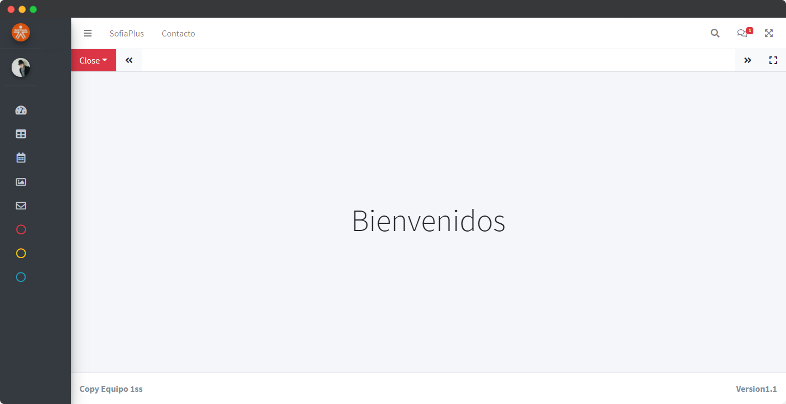

# Sistema de Comites y Evaluación SENA - SCES (ADSI - 2068676)

SCES es un sistema que automatiza el proceso de citaciones a comités en el centro de Automatización Industrial regional caldas. Actualmente se encuentra en desarrollo.

## Seguimiento al proyecto

-   [Trello](https://trello.com/b/daVyYd6Q/proyecto-sces)📑

## Documentación

-   [Drive](https://drive.google.com/drive/folders/1Fzh4KJHFXNLwXUvxsAvGz2Rm7-AU5ygL?usp=sharing)

## Plantilla

## Grupos

### Grupo 1

-   Alejandro B
-   Gisela Criollo Suarez
-   Vanesa Morales
-   Valentina Duque

### Grupo 2

-   Carlos Álape
-   Julian Posada
-   Valentina Estrada
-   Daniel Sánchez

### Grupo 3

-   Andres Fajardo
-   Daniela Menjura
-   Jacobo Osorio
-   Juan David Velez

### Grupo 4

-   Andrea
-   Andres Cano
-   Jaime Cárdona
-   Jeronimo Montoya

## Herramientas Usadas

-   PHP
-   Laravel
-   Html
-   CSS
